# Idrop.in · 云集

<p align="center">
  
</p>

> 面向教育场景的智能文件收集与管理平台

[](https://github.com/poboll/idropin/actions/workflows/build-and-release.yml)
[](https://www.oracle.com/java/)
[](https://spring.io/projects/spring-boot)
[](https://nextjs.org/)
[](https://www.postgresql.org/)
[](https://hub.docker.com/u/poboll)
[](LICENSE)

## 概览

Idrop.in 云集是一个前后端分离的教育文件管理平台，提供文件收集任务、大文件分片上传、AI 智能批阅、多存储后端切换、实时统计看板等核心能力。

## 核心功能

| 模块 | 能力 |
|---|---|
| 认证与权限 | JWT 无状态认证、令牌刷新、Spring Security 6、细粒度 RBAC |
| 收集任务 | 多类型收集（文件 / 信息 / 混合）、截止时间、提交统计、人员名单 |
| 文件管理 | 大文件分片上传（5 MB / 片）、断点续传、秒传、批量操作、回收站 |
| 多存储后端 | MinIO / 七牛云 / 本地存储，运行时动态切换，无需重启 |
| AI 批阅 | 提交内容自动评分、雷达图可视化、批量 AI Review、SSE 实时进度 |
| 文件分享 | 短链接、密码保护、过期时间、下载次数限制 |
| 实时统计 | SSE 推送（每30秒轮询）、多维度图表（Recharts）、访问日志 |
| 后台管理 | 用户管理、系统配置、邮件 / 存储配置、反馈处理、操作审计 |
| 全文搜索 | PostgreSQL 16 全文搜索，复合过滤条件 |
| PWA | Service Worker、离线访问、App 级体验 |

## ✨ 系统截图

<details>
<summary>点击展开查看系统核心页面截图</summary>
<br>

| 前台页面 | 用户工作台 |
| :---: | :---: |
| **首页**<br>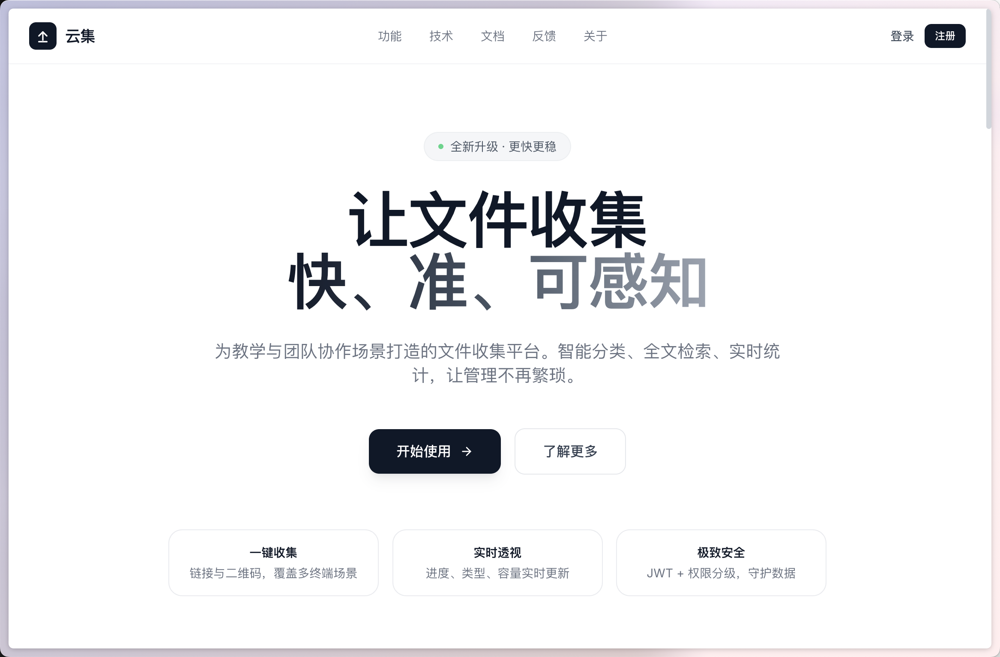 | **文件管理**<br>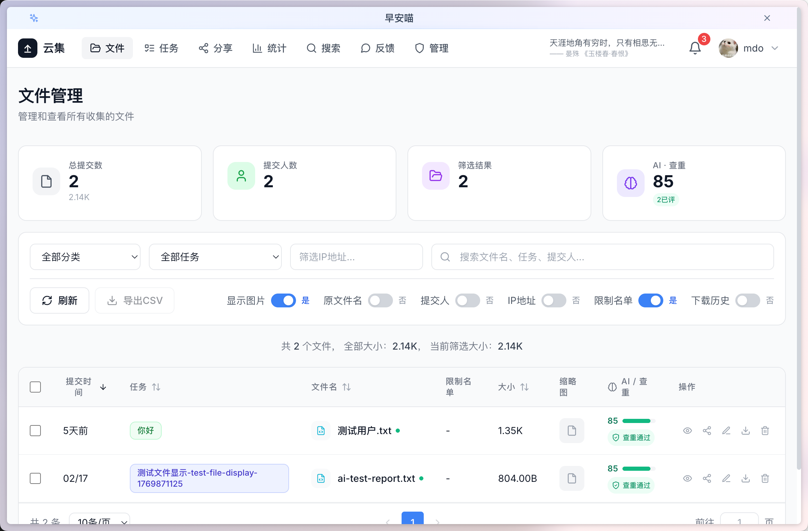 |
| **功能介绍**<br>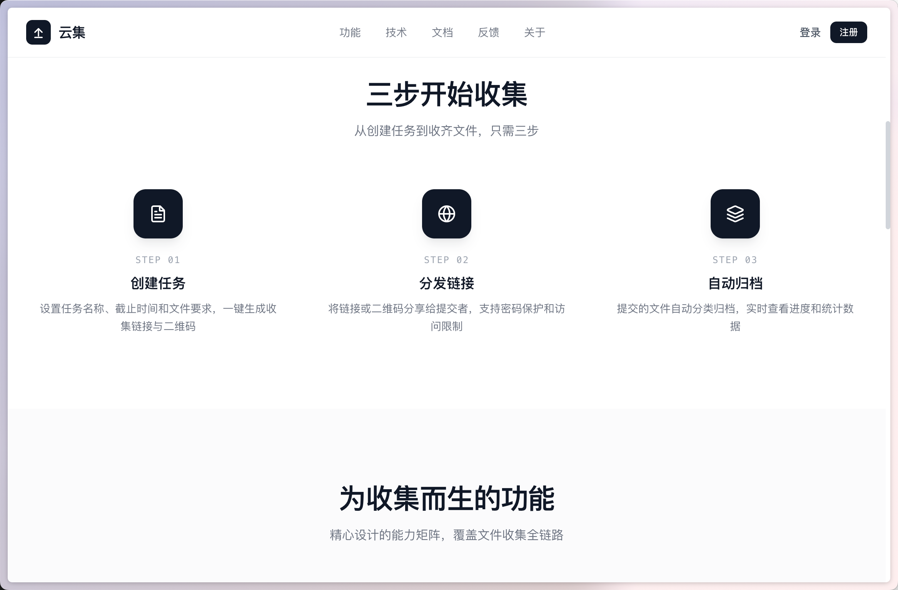 | **任务管理**<br>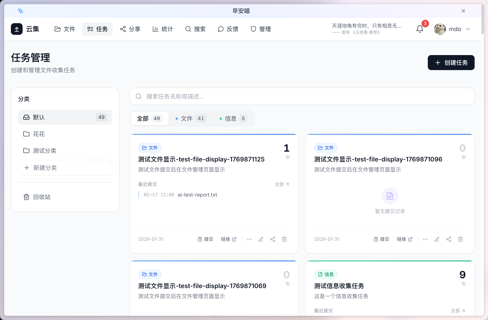 |
| **登录/注册**<br>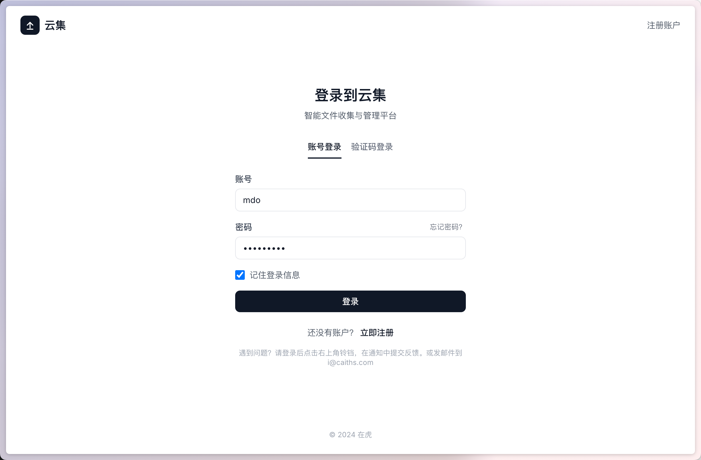 | **数据统计**<br>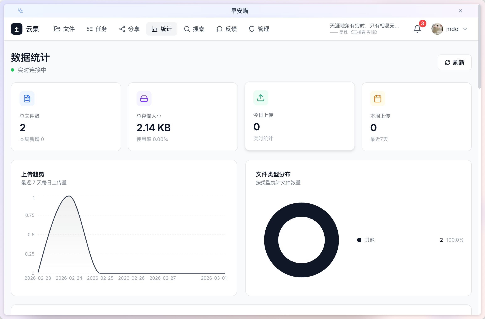 |

| 收集与分享 | 管理后台 |
| :---: | :---: |
| **文件收集表单**<br>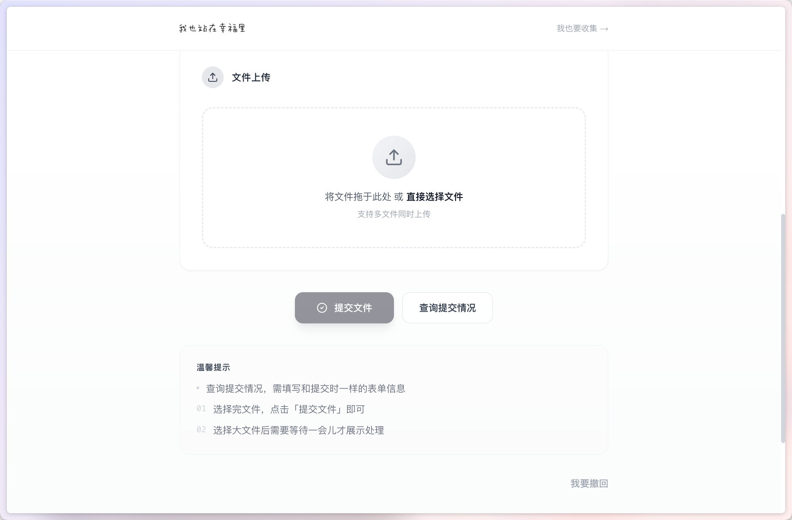 | **后台概览**<br>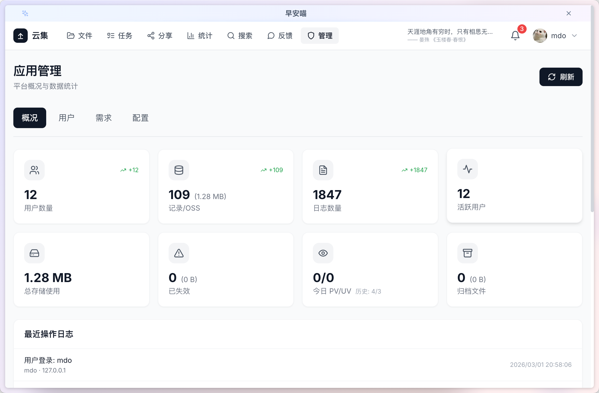 |
| **收集任务视图**<br>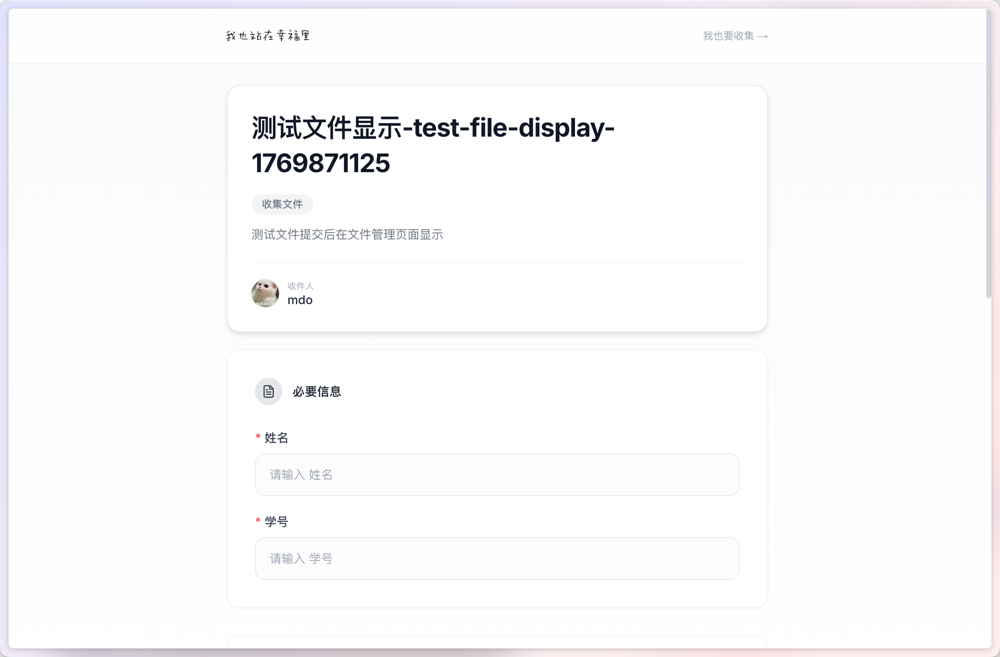 | **用户管理**<br>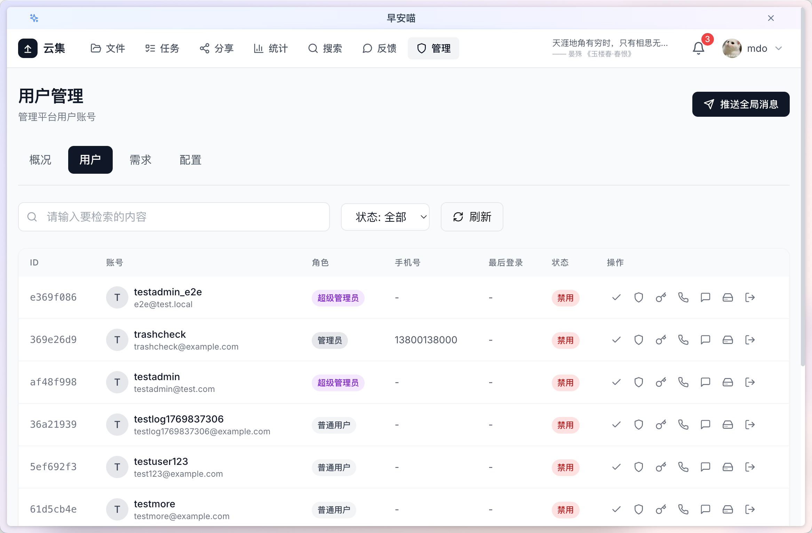 |
| **分享链接**<br>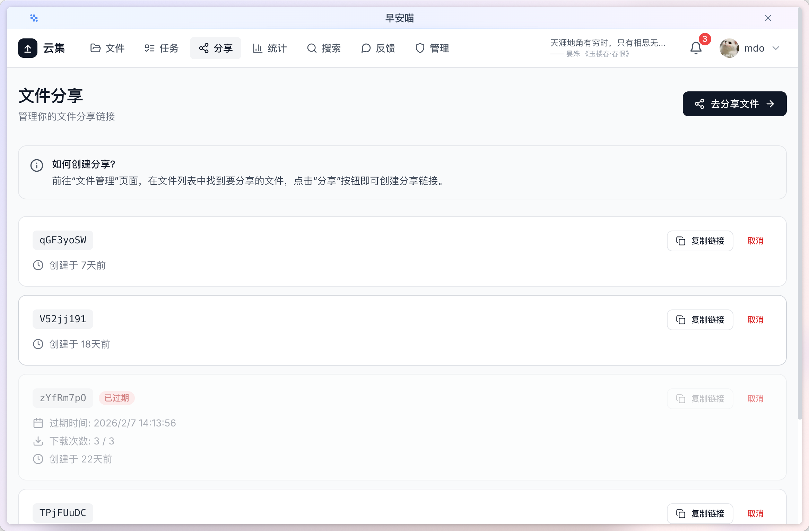 | **系统配置**<br>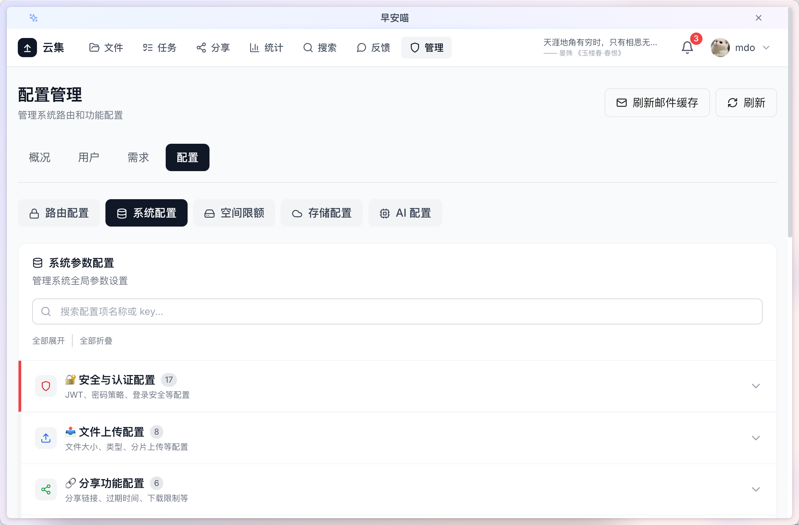 |
| **提交历史**<br>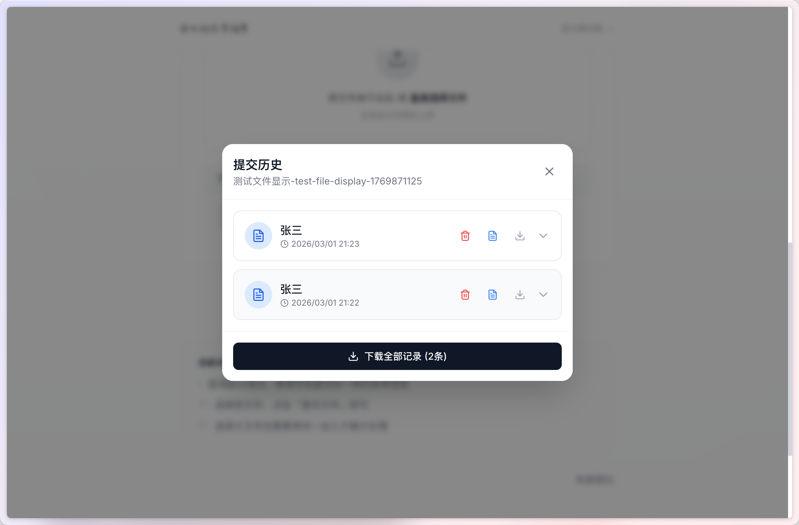 | **AI 批阅配置**<br>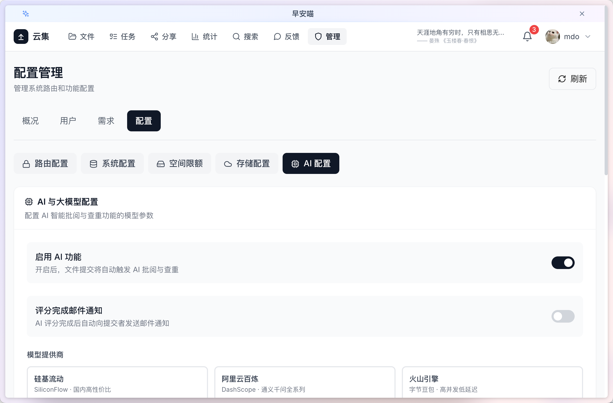 |

</details>

## 技术栈

### 后端

| 组件 | 版本 |
|---|---|
| Java | 21 |
| Spring Boot | 3.5.11 |
| Spring Security | 6.x |
| MyBatis Plus | 3.5.7 |
| PostgreSQL | 16 |
| Redis | 7.x |
| MinIO | 8.6.0 |
| 七牛云 | 7.19.0 |
| JWT (jjwt) | 0.12.3 |
| Knife4j | 4.5.0 |
| Apache POI | 5.2.4 |
| PDFBox | 3.0.6 |

### 前端

| 组件 | 版本 |
|---|---|
| Next.js | 14.x |
| React | 18.2 |
| TypeScript | 5.3 |
| Tailwind CSS | 3.4 |
| Zustand | 5.x |
| SWR | 2.4 |
| Recharts | 2.10 |

### 基础设施

| 服务 | 说明 |
|---|---|
| PostgreSQL 16 | 主数据库 + 全文搜索 |
| Redis 7.x | 缓存、Session、Token |
| MinIO (可选) | 对象存储 |
| Docker | 容器化部署 |

## 项目结构

```
idropin/
├── idropin-backend/           # Spring Boot 后端
│   ├── src/main/java/com/idropin/
│   │   ├── common/            # 常量、异常、工具、配置
│   │   ├── domain/            # 实体、VO、DTO
│   │   ├── infrastructure/    # 基础设施
│   │   │   ├── ai/           # AI 客户端、文档提取
│   │   │   ├── cache/        # 缓存服务
│   │   │   ├── config/       # 配置类
│   │   │   ├── email/        # 邮件服务
│   │   │   ├── interceptor/  # 请求拦截器
│   │   │   ├── persistence/  # MyBatis 映射
│   │   │   ├── ratelimit/   # 限流
│   │   │   ├── scheduler/    # 定时任务
│   │   │   ├── security/    # JWT认证、权限
│   │   │   └── storage/     # 存储抽象层
│   │   ├── application/      # 业务服务层
│   │   │   ├── service/      # 20个业务服务
│   │   │   └── facade/      # 门面接口
│   │   └── interfaces/       # 接口层
│   │       ├── rest/         # 19个 REST Controller
│   │       └── scheduler/    # 定时任务
│   └── src/main/resources/
│       ├── application.yml
│       ├── init-database.sql
│       └── db/migration/
└── idropin-frontend/          # Next.js 前端
    ├── src/app/              # App Router 页面
    │   ├── dashboard/       # 用户仪表盘
    │   ├── task/            # 任务管理
    │   ├── docs/            # 文档页
    │   └── (其他页面)
    ├── src/components/      # React 组件
    ├── src/hooks/           # 自定义 Hooks
    └── public/              # 静态资源 / PWA
```

## 快速开始

### 前置依赖

- Docker 20+（运行 PostgreSQL、Redis）
- Java 21+
- Node.js 18+、npm 9+

### 启动

```bash
git clone https://github.com/poboll/idropin.git
cd idropin

# 启动依赖服务
docker start postgres redis

# 初始化数据库（首次）
docker exec -i idropin-postgres psql -U idropin -d idropin < idropin-backend/src/main/resources/init-database.sql

# 启动后端
cd idropin-backend && mvn spring-boot:run &

# 启动前端
cd ../idropin-frontend && npm install && npm run dev
```

| 服务 | 地址 |
|---|---|
| 前端 | http://localhost:5224 |
| 后端 API | http://localhost:8081/api |
| API 文档 | http://localhost:8081/api/doc.html |

**默认账号** — 管理员：`admin / admin123`，普通用户：`demo / admin123`

### Docker 部署

```bash
docker-compose up -d
```

## REST API (19个 Controller)

| Controller | 路径 | 说明 |
|---|---|---|
| AuthController | /api/auth | 登录注册、验证码 |
| UserController | /api/users | 用户管理 |
| CollectionTaskController | /api/tasks | 收集任务 CRUD |
| ChunkUploadController | /api/upload/chunk | 分片上传 |
| FileController | /api/files | 文件管理 |
| FileShareController | /api/shares | 文件分享 |
| CategoryController | /api/categories | 分类管理 |
| PeopleController | /api/people | 人员名单 |
| SearchController | /api/search | 全文搜索 |
| StatisticsController | /api/statistics | 统计数据 |
| StatisticsSseController | /api/statistics/stream | SSE 实时统计 |
| AiProgressSseController | /api/tasks/{taskId}/ai-progress | SSE AI 进度 |
| AIClassificationController | /api/ai/classification | AI 分类 |
| FeedbackController | /api/feedback | 反馈管理 |
| ConfigController | /api/config | 系统配置 |
| MessageController | /api/messages | 消息通知 |
| AdminController | /api/admin | 管理后台 |
| AccessLogController | /api/logs | 访问日志 |
| HealthController | /api/health | 健康检查 |

## 存储架构

```
StorageServiceManager (存储抽象层)
├── LocalStorageService      # 本地磁盘存储 (默认)
├── MinioStorageService     # MinIO 对象存储
└── QiniuStorageService     # 七牛云 OSS
```

运行时可通过配置 `storage.type` 动态切换，无需重启。

## AI 模块

- **AiClientService**: AI API 调用封装
- **DocumentExtractService**: 文档内容提取（支持 PDF、Word、Text）

使用 SSE 推送 AI 批阅进度，前端实时显示。

## 实时推送

使用 **SSE (Server-Sent Events)**，非 WebSocket：

- `StatisticsSseController`: 统计数据每30秒推送一次
- `AiProgressSseController`: AI 批阅进度实时推送

## 限流与安全

- **RateLimit**: 基于 IP + 接口的限流（注解驱动）
- **JwtTokenUtil**: JWT 生成与验证
- **JwtAuthenticationFilter**: 请求拦截认证

## 定时任务

- **ChunkCleanupScheduler**: 清理未完成的上传分片

## CI/CD

每次 push 到 `main` 分支：

1. 构建前后端产物
2. 构建 Docker 镜像推送到 Docker Hub
3. 打版本 Tag 发布 GitHub Release

## 许可证

[MIT](LICENSE) © Idrop.in Team
